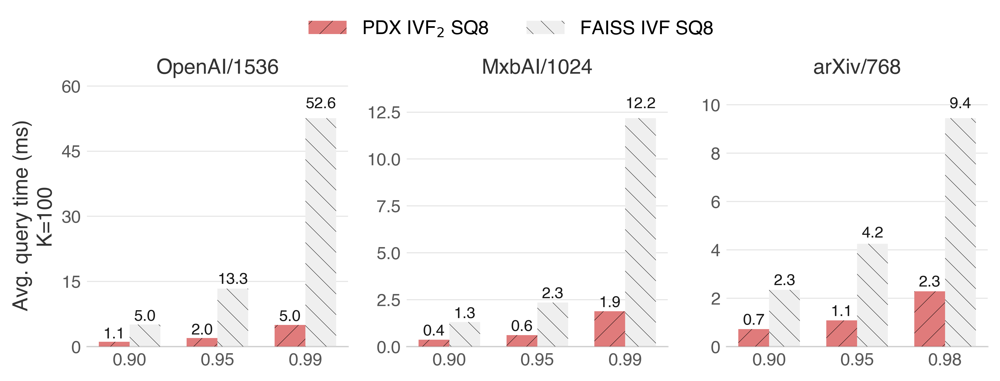
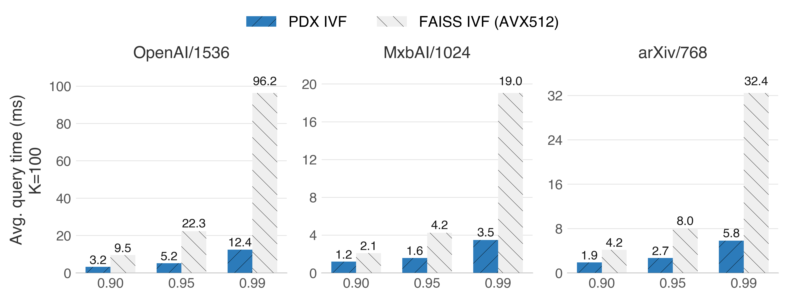
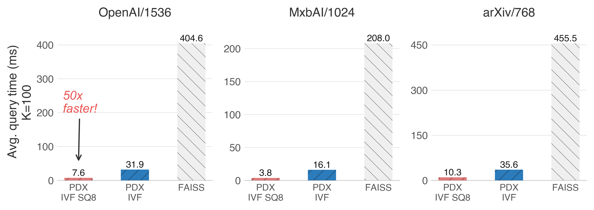

# Benchmarks

We present single-threaded **benchmarks** against FAISS+AVX512 on an `r7iz.xlarge` (Intel Sapphire Rapids) instance. 

### Two-Level IVF (IVF<sub>2</sub>) 
IVF<sub>2</sub> tackles a bottleneck of IVF indexes: finding the nearest centroids. By clustering the original IVF centroids, we can use PDX to quickly scan them (thanks to pruning) without sacrificing recall. This achieves significant throughput improvements when paired with `8-bit` quantization. Within the codebase, we refer to this index as `PDXTree`.

<p align="center">
        
</p>

### Vanilla IVF
Here, PDX, paired with the pruning algorithm ADSampling on `float32`, achieves significant speedups.

<p align="center">
        
</p>


### Exhaustive search + IVF
An exhaustive search scans all the vectors in the collection. Having an IVF index with PDX can **EXTREMELY** accelerate this without sacrificing recall, thanks to the reliable pruning of ADSampling.

<p align="center">
        
</p>

The key observation here is that thanks to the underlying IVF index, the exhaustive search starts with the most promising clusters. A tight threshold is found early on, which enables the quick pruning of most candidates.

### No pruning and no index
Even without pruning, PDX distance kernels can be faster than SIMD ones in most CPU microarchitectures. For detailed information, check Figure 3 of [our publication](https://ir.cwi.nl/pub/35044/35044.pdf). You can also try it yourself in our playground [here](./benchmarks/kernels_playground).

# Benchmarking

## Setting up Data

To download all the datasets and generate all the indexes needed to run our benchmarking suite, you can use the script [setup_data.py](/benchmarks/python_scripts/setup_data.py). For this, you need Python 3.11 or higher and install the dependencies in `/benchmarks/python_scripts/requirements.txt`. 

Run the script from the root folder with the script flags `DOWNLOAD` and `GENERATE_IVF` set to `True`. You do not need to generate the `ground_truth` for k <= 100 as it is already present. 

You can specify the datasets you wish to create indexes for on the `DATASETS_TO_USE` array in [setup_data.py](/benchmarks/python_scripts/setup_data.py).

```sh
pip install -r ./benchmarks/python_scripts/requirements.txt
python ./benchmarks/python_scripts/setup_data.py
```

The indexes will be created under the `/benchmarks/datasets/` directory.

### Manually downloading data
You can also:
- Manually download all the datasets from a .zip file (~60GB zipped and ~80GB unzipped) [here](https://drive.google.com/file/d/1ei6DV0goMyInp_wFcrbJG3KV40mAPfAa/view?usp=sharing). You must put the unzipped `.hdf5` files inside `/benchmarks/datasets/downloaded`.
- Download datasets individually from [here](https://drive.google.com/drive/folders/1f76UCrU52N2wToGMFg9ir1MY8ZocrN34?usp=sharing). 

Then, run the Master Script with the flag `DOWNLOAD = False`. 

You can specify the datasets you wish to create indexes for on the `DATASETS_TO_USE` array in [setup_data.py](/benchmarks/python_scripts/setup_data.py).


### Configuring the IVF indexes
Configure the IVF indexes in [/benchmarks/python_scripts/setup_core_index.py](/benchmarks/python_scripts/setup_core_index.py). 

## Running Benchmarks
Once you have downloaded and created the indexes, you can start benchmarking. 

## Prerequisites

### Clang, CMake, OpenMP and a BLAS implementation 
Check [INSTALL.md](./INSTALL.md). 

### Building
We built our scripts with the proper `march` flags. Below are the flags we used for each microarchitecture:
```sh
cmake . -DPDX_COMPILE_BENCHMARKS=ON
make benchmarks
```

## Benchmarking scripts list
- Index Creation and Search: `/benchmarks/BenchmarkEndToEnd`
- PDX IVF: `/benchmarks/BenchmarkPDXIVF`
- FAISS IVF: `/benchmarks/python_scripts/ivf_faiss.py`

PDX programs have three parameters:
- `<index_type>` to specify the type of PDX index to use. We support 4 index types. From least to most performant: 
   - `pdx_f32`: IVF index with float32 vectors
   - `pdx_tree_f32`: Tree IVF index with float32 vectors
   - `pdx_u8`: IVF index with 8-bit scalar quantization
   - `pdx_tree_u8`: Tree IVF index with 8-bit scalar quantization
- `<dataset_name>` to specify the identifier of the dataset to use. If not given, it will try to use all the datasets set in [benchmark_utils.hpp](/include/utils/benchmark_utils.hpp) or [benchmark_utils.py](/benchmarks/python_scripts/benchmark_utils.py) in the Python scripts.
- `<nprobe>` to specify the `nprobe` parameter on the IVF index, which controls the recall. If not given or `0`, it will use a series of parameters from 2 to 4096 set in the [benchmark_utils.hpp](/include/utils/benchmark_utils.hpp) or [benchmark_utils.py](/benchmarks/python_scripts/benchmark_utils.py) in the Python scripts.

<details>

<summary><b>List of Datasets</b></summary>

| Identifier   | Dataset HDF5 Name in Google Drive   | Embeddings    | Model        | # Vectors | Dim. | Size (GB) ↑ |
| ------------ | ----------------------------------- | ------------- | ------------ | --------- | ---- | ----------- |
| `arxiv`      | `instructorxl-arxiv-768`            | Text          | InstructorXL | 2,253,000 | 768  | 6.92        |
| `openai`     | `openai-1536-angular`               | Text          | OpenAI       | 999,000   | 1536 | 6.14        |
| `wiki`       | `simplewiki-openai-3072-normalized` | Text          | OpenAI       | 260,372   | 3072 | 3.20        |
| `mxbai`      | `agnews-mxbai-1024-euclidean`       | Text          | MXBAI        | 769,382   | 1024 | 3.15        |

</details>

> [!IMPORTANT]   
> Recall that the IVF indexes must be created beforehand by the `setup_data.py` script.

## Output
Output is written in a .csv format to the `/benchmarks/results/DEFAULT` directory. Each file contains entries detailing the experiment parameters, such as the dataset, algorithm, kNN, number of queries (`n_queries`), `ivf_nprobe`, and, more importantly, the average runtime per query in ms in the `avg` column. Each benchmarking script will create a file with a different name.
