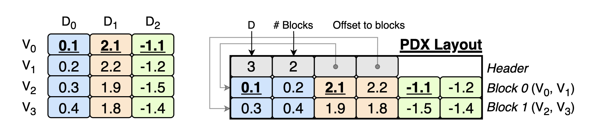

# PDX: A Vertical Data-Layout for Vector Similarity Search

[PDX](https://ir.cwi.nl/pub/35044/35044.pdf) is a **vertical** data layout for vectors that stores together the dimensions of different vectors. In a nutshell, PDX is a PAX for vector similarity search.

<p align="center">
        
</p>


### What are the benefits of storing vectors vertically?

- ✂️ Efficient and reliable **pruning** of dimensions with partial distance calculations. 
- ⚡ Up to [**7x faster**](#ivf-indexes) IVF queries (compared to FAISS+AVX512) when pairing PDX with the pruning algorithm [ADSampling](https://github.com/gaoj0017/ADSampling/).
- ⚡ Up to [**13x faster**](#exact-search--ivf) exhaustive search thanks to pruning.
- ⚡ Raw distance kernels (no pruning) in PDX are up to [**40% faster**](#no-pruning-and-no-index) than the `float32` kernels available in [SimSIMD](https://github.com/ashvardanian/SimSIMD) and [FAISS](https://github.com/facebookresearch/faiss/). 
  - *Why?* ➡️ Distance kernels in PDX are free of dependencies and have less LOAD/STORE operations. 
- Distance kernels auto-vectorize efficiently without explicit SIMD for `float32`.
- Distance calculations on small vectors (`d < 16`) are up to **8x faster** than SIMD kernels in [SimSIMD](https://github.com/ashvardanian/SimSIMD).
- More efficient compressed representations of vectors (WIP).


# Contents
- [Pruning in a Nutshell](#pruning-in-a-nutshell)
- [Quickstart](#try-it-out)
- [Use cases (comparison with FAISS)](#use-cases)
- [Roadmap](#roadmap)

## Pruning in a nutshell

*Pruning* means avoiding checking *all* the dimensions of a vector to determine if it will make it onto the KNN of a query. Pruning speedup vector similarity search as (i) **less data** must be fetched and (ii) **fewer computations** must be done.

However, pruning methods that do partial distance calculations have a hard time to be on-par to SIMD optimized kernels like the ones in [FAISS](https://github.com/facebookresearch/faiss/) and [SimSIMD](https://github.com/ashvardanian/SimSIMD). 

**Only thanks to the PDX layout**, pruning methods outperform SIMD optimized kernels in all CPU microarchitectures (Zens, Intels, Gravitons). This is because in PDX, distance calculations are efficient even in small vector segments. And, the evaluation of the pruning predicate is not interleaved with distance calculations.

Pruning algorithms are **especially effective** when:
- Vectors are of high dimensinality (`d > 512`)
- High recalls are needed (`> 0.90`)
- Exact results are needed
- `k` is relatively low (`k=10,20`)

Click [here](#use-cases) to see some quick benchmarks. The full **benchmarks** are available in [our publication](https://ir.cwi.nl/pub/35044/35044.pdf). We performed experiments in 4 microarchitectures: Intel SPR, Zen 4, Zen 3 and Graviton 4. Furthermore, you will find details on how we adapted these novel pruning algorithms to work in PDX.

We also refer to the recent research done on pruning algorithms with partial distance calculations: [ADSampling](https://github.com/gaoj0017/ADSampling/), [BSA](https://github.com/mingyu-hkustgz/Res-Infer), [DADE](https://github.com/Ur-Eine/DADE). All of these rely on rotating the vectors collection to prune effectively. In [our research](https://ir.cwi.nl/pub/35044/35044.pdf), we also introduce **PDX-BOND**, a simpler pruning algorithm which does not need to rotate the vectors. 


## Quickstart
You can quickly try out PDX with your data by using our Python bindings and our [examples](/examples). We have implemented PDX on Flat **IVF indexes** and **exhaustive search** settings.
### Prerequisites
- Python 3.11 or higher
- [FAISS](https://github.com/facebookresearch/faiss/blob/main/INSTALL.md) with Python Bindings
- Clang++17 or higher
- CMake 3.26 or higher

### Steps
1. Clone the repository and init submodules (`Eigen` for efficient matrix operations and `pybind11`)
```sh
git clone https://github.com/cwida/PDX
git submodule init
git submodule update
```
2. Install Python dependencies and `pdxearch` Python bindings. 
```sh
export CXX="/usr/bin/clang++-18"  # Set proper CXX first
pip install -r requirements.txt
python setup.py clean --all
python -m pip install .
```
3. Run the examples under `./examples`
```sh
# Creates an IVF index with FAISS on random data
# Then, it compares the search performance of PDXearch and FAISS
python ./examples/pdxearch_simple.py
```
For more details on the available examples, and how to use your own data, refer to [/examples/README.md](./examples/README.md). 

### Notes
- We heavily rely on [FAISS](https://github.com/facebookresearch/faiss/blob/main/INSTALL.md) to create the underlying IVF indexes. 
- PDX is an ongoing research project. In its current state, it is not production-quality code.

## Use Cases
### IVF indexes
PDX paired with [ADSampling](https://github.com/gaoj0017/ADSampling/) on IVF indexes works great in most scenarios with less than 0.001 recall loss. The higher the dimensionality, the higher the gains from pruning. The following benchmarks are from [./examples/pdxearch_ivf.py](./examples/pdxearch_ivf.py)

| Avg. query time <br> [<ins>Intel SPR</ins> \| r7iz.2x] | FAISS AVX512 <br> R@10: 0.99 · 0.95 · 0.90 | PDXearch           | Improvement            |
|--------------------------------------------------------|-----------------------------------------|--------------------|------------------------|
| DBPedia · d=1536 · 1M                                | 53.6 · 18.0 · 7.7 ms                    | 7.4 · 3.7 · 2.4 ms | **7.2x · 4.9x · 3.2x** |
| arXiv · d=768 · 2.25M                                | 25.9 · 7.7 · 3.5                        | 6.2 · 2.8 · 1.7    | **4.2x · 2.8x · 2.1x** |
| SIFT · d=128 · 1M                                    | 1.7 · 0.6 · 0.4                         | 1.0 · 0.4 · 0.3    | **1.7x · 1.5x · 1.3x** |

| Avg. query time <br> [<ins>Graviton 4</ins> \| r8g.2x] | FAISS SVE <br> R@10: 0.99 · 0.95 · 0.90 | PDXearch           | Improvement            |
|-------------------------------------------------------------|-----------------------------------|--------------------|------------------------|
| DBPedia · d=1536 · 1M                                     | 47.1 · 18.4 · 6.7 ms              | 7.1 · 4.1 · 2.5 ms | **6.6x · 4.5x · 2.7x** |
| arXiv · d=768 · 2.25M                                     | 25.3 · 7.0 · 3.2                  | 5.9 · 2.7 · 1.7    | **4.3x · 2.6x · 1.9x** |
| SIFT · d=128 · 1M                                         | 1.1 · 0.5 · 0.3                   | 0.7 · 0.4 · 0.2    | **1.6x · 1.3x · 1.3x** |

**NOTE THAT on these benchmarks: (i) Both FAISS and PDXearch are scanning exactly the same vectors. (ii) The recall loss of ADSampling is always less than 0.001.**

### Exact search + IVF
In PDX, building an IVF index can greatly improve exact search speed (thanks to the reliable pruning). The following benchmarks are from [./examples/pdxearch_ivf_exhaustive.py](./examples/pdxearch_ivf_exhaustive.py).

| Avg. query time<br>[<ins>Intel SPR</ins> \| r7iz.2x] | FAISS AVX512 | PDXearch | Improvement |
|-------------------------------------------------------------------|--------------|----------|-------------|
| DBPedia · d=1536 · 1M                                           | 411.7 ms     | 34.9 ms  | **11.8x**   |
| GIST · d=960 · 1M                                               | 252.9        | 27.6     | **9.1x**    |
| arXiv · d=768 · 2.25M                                           | 454.5        | 41.4     | **11.0x**   |
| SIFT · d=128 · 1M                                               | 34.4         | 6.5      | **5.3x**    |

| Avg. query time<br>[<ins>Graviton 4</ins> \| r8g.2x] | FAISS SVE | PDXearch | Improvement |
|-----------------------------------------------------------|-----------|----------|-------------|
| DBPedia · d=1536 · 1M                                   | 277.2 ms  | 21.7 ms  | **12.8x**   |
| GIST · d=960 · 1M                                       | 170.9     | 19.4     | **8.8x**    |
| arXiv · d=768 · 2.25M                                   | 306.0     | 27.2     | **11.3x**   |
| SIFT · d=128 · 1M                                       | 21.3      | 4.7      | **4.5x**    |

### Exact search without an index
Use **PDX+BOND**, our own pruning algorithm. Here, vectors are not transformed and we do not use any additional index. Gains vary depending on the dimensions distribution. The following benchmarks are from [./examples/pdxearch_exact_bond.py](./examples/pdxearch_exact_bond.py)

| Avg. query time<br>[<ins>Intel SPR</ins> \| r7iz.2x] | FAISS AVX512 | PDXearch | Improvement |
|-----------------------------------------------------------|--------------|----------|-------------|
| DBPedia · d=1536 · 1M                                   | 374 ms       | 216 ms   | **1.7x**    |
| arXiv · d=768 · 2.25M                                   | 422          | 212      | **2.0x**    |
| MSong · d = 420 · 1M                                    | 117          | 15       | **7.8x**    |
| SIFT · d=128 · 1M                                       | 31           | 10       | **3.1x**    |

| Avg. query time <br> [<ins>Graviton 4</ins> \| r8g.2x] | FAISS SVE | PDXearch | Improvement |
|-------------------------------------------------------------|-----------|----------|-------------|
| DBPedia · d=1536 · 1M                                     | 278 ms    | 139 ms   | **2.0x**    |
| arXiv · d=768 · 2.25M                                     | 305       | 155      | **2.0x**    |
| MSong · d = 420 · 1M                                      | 70        | 15       | **4.7x**    |
| SIFT · d=128 · 1M                                         | 22        | 11       | **2.0x**    |


### No pruning and no index
PDX distance kernels are also faster than the state-of-the-art SIMD kernels in all major architectures, only relying on auto-vectorization (for `float32`). The following benchmarks are from [./examples/pdx_brute.py](./examples/pdx_brute.py)

| Avg. query time<br>[Intel SPR \| r7iz.2x] | FAISS AVX512 | PDXearch | Improvement |
|-------------------------------------------------|--------------|----------|-------------|
| GIST · d=960 · n=1M                             | 247 ms       | 208 ms   | **1.2x**    |
| STL · d=9216 · n=90K                            | 220          | 176      | **1.3x**    |

| Avg. query time<br>[Graviton 4 \| r8g.2x] | FAISS SVE | PDXearch | Improvement |
|-------------------------------------------|-----------|----------|-------------|
| GIST · d=960 · n=1M                       | 172       | 124      | **1.4x**    |
| STL · d=9216 · n=90K                      | 160       | 109      | **1.5x**    |


Please, refer to [our publication](https://ir.cwi.nl/pub/35044/35044.pdf) for the complete benchmarks of PDXearch done in 4 microarchitectures: Intel SPR, Zen 4, Zen 3 and Graviton 4. Here, you will also find a comparison against ADSampling in the horizontal layout (`.fvecs` layout). Furthermore, you will find details on how we adapted pruning algorithms to work in PDX.

## Roadmap
- **Compression**: The vertical layout opens opportunities for compression as indexing algorithms group together vectors that share some numerical similarity within their dimensions. A next step on PDX is to apply our scalar quantization algorithm [LEP](https://homepages.cwi.nl/~boncz/msc/2024-ElenaKrippner.pdf) that uses database compression techniques ([ALP](https://github.com/cwida/alp)) to compress vectors with higher compression ratios and less information loss.
- **More data types**: For compressed vectors, we need to implement vertical distance kernels on vectors of variable bit size.
- **PDX in HNSW**: For this, we need a layout similar to the ones proposed in [Starling](https://dl.acm.org/doi/pdf/10.1145/3639269) or [AiSAQ](https://arxiv.org/pdf/2404.06004), in which neighborhoods of the graph are stored and fetched in blocks.
- Improve code readibility and usability.
- Add a testing framework
- Add BSA or DADE algorithms to the Python Bindings

## Benchmarking
To run our benchmark suite in C++, refer to [BENCHMARKING.md](./BENCHMARKING.md).

## SIGMOD
The code used for the experiments presented at SIGMOD'25 can be found in the `sigmod` branch.


