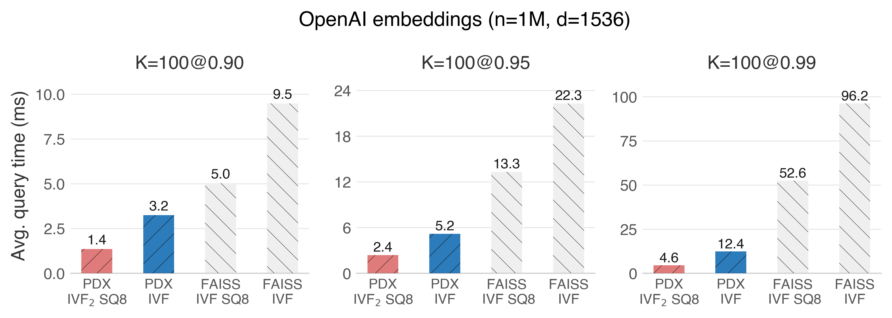

<h1 align="center">
  PDX
<div align="center">
    <a href="https://arxiv.org/pdf/2503.04422"></a>
    
    <a href="https://github.com/cwida/PDX/blob/main/LICENSE"></a>
    <a href="https://github.com/cwida/PDX/stargazers"></a>
</div>
</h1>
<h3 align="center">
  Easy and extremely fast similarity search
</h3>

<p align="center">
        
</p>

<h3 align="center">
  Build your vector index 100x faster than HNSW, without being slow:
</h3>
<p align="center">
        
</p>

### Why PDX:

- ⚡ [100x faster index building](https://www.lkuffo.com/superkmeans/) thanks to [SuperKMeans](https://github.com/lkuffo/SuperKMeans).
- ⚡ [Sub-millisecond similarity search](https://www.lkuffo.com/sub-milisecond-similarity-search-with-pdx/), up to [**10x faster**](#two-level-ivf-ivf2-) than FAISS IVF.
- ⚡ Up to [**30x faster**](#exhaustive-search--ivf) exhaustive search.
- 🔍 Efficient [**filtered search**](https://github.com/cwida/PDX/issues/7).

## Our secret sauce

[PDX](https://ir.cwi.nl/pub/35044/35044.pdf) is a data layout that **transposes** vectors in a column-major order. This layout unleashes the true potential of dimension pruning.

Pruning means avoiding checking *all* the dimensions of a vector to determine if it is a neighbour of a query. The PDX layout unleashes the true potential of these algorithms, accelerating partition-based indexes by factors.

[Down below](#use-cases-and-benchmarks), you will find **benchmarks** against FAISS. 


## Usage
Try PDX with your data using our Python bindings and [examples](/examples). We have implemented PDX on Flat (`float32`) and Quantized (`8-bit`) **IVF indexes** and **exhaustive search** settings.
### Prerequisites
- PDX is available for x86 (AVX2 and AVX512), ARM, and Apple Silicon
- Python 3.11 or higher
- Clang++17 or higher
- CMake 3.26 or higher

### Installation Steps
```sh
git clone --recurse-submodules https://github.com/cwida/PDX

python -m pip install .
```

4. Run the examples under `/examples`
```sh
# Creates an IVF index with FAISS on random data
# Then, it compares the search performance of PDXearch and FAISS
python ./examples/pdx_simple.py
```

For more details on the available examples and how to use your own data, refer to [/examples/README.md](./examples/README.md). 

## Use Cases and Benchmarks
Check [./BENCHMARKING.md](./BENCHMARKING.md).

## The Data Layout
PDX is a transposed layout (a.k.a. columnar, or decomposed layout), which means that the same dimensions of different vectors are stored sequentially. This decomposition occurs within a block (e.g., a cluster in an IVF index). 

We have evolved our layout from the one presented in our publication to reduce random access, and adapted it to work with `8-bit` and (in the future) `1-bit` vectors. 

### `float32`
For `float32`, the first 25% of the dimensions are fully decomposed. We refer to this as the "vertical block." The rest (75%) are decomposed into subvectors of 64 dimensions. We refer to this as the "horizontal block." The vertical block is used for efficient pruning, and the horizontal block is accessed on the candidates that were not pruned. This horizontal block is still decomposed every 64 dimensions. The idea behind this is that we still have a chance to prune the few remaining candidates every 64 dimensions. 

The following image shows this layout. Storage is sequential from left to right, and from top to bottom.
<p align="center">
        
</p>

### `8 bits`
Smaller data types are not friendly to PDX, as we must accumulate distances on wider types, resulting in asymmetry. We can work around this by changing the PDX layout. For `8 bits`, the vertical block is decomposed every 4 dimensions. This allows us to use dot product instructions (`VPDPBUSD` in [x86](https://www.officedaytime.com/simd512e/simdimg/si.php?f=vpdpbusd) and `UDOT/SDOT` in [NEON](https://developer.arm.com/documentation/102651/a/What-are-dot-product-intructions-)) to calculate L2 or IP kernels while still benefiting from PDX. The horizontal block remains decomposed every 64 dimensions. 
<p align="center">
        
</p>


<!-- ### `binary`
For Hamming/Jaccard kernels, we use a layout decomposed every 8 dimensions (naturally grouped into bytes). The population count accumulation can be done in `bytes`. If d > 256, we flush the popcounts into a wider type every 32 words (corresponding to 256 dimensions). This has not been implemented in this repository yet, but you can find some promising benchmarks [here](https://github.com/lkuffo/binary-index).  -->

## Roadmap
- Out-of-core execution (disk-based setting).
- Implement multi-threading capabilities.
- Add PDX to the [VIBE benchmark](https://vector-index-bench.github.io/).
- Create a documentation.

## Benchmarking
To run our benchmark suite in C++, refer to [BENCHMARKING.md](./BENCHMARKING.md).

## Citation
If you use PDX for your research, consider citing us:

```
@article{kuffo2025pdx,
  title={PDX: A Data Layout for Vector Similarity Search},
  author={Kuffo, Leonardo and Krippner, Elena and Boncz, Peter},
  journal={Proceedings of the ACM on Management of Data},
  volume={3},
  number={3},
  pages={1--26},
  year={2025},
  publisher={ACM New York, NY, USA}
}
```
