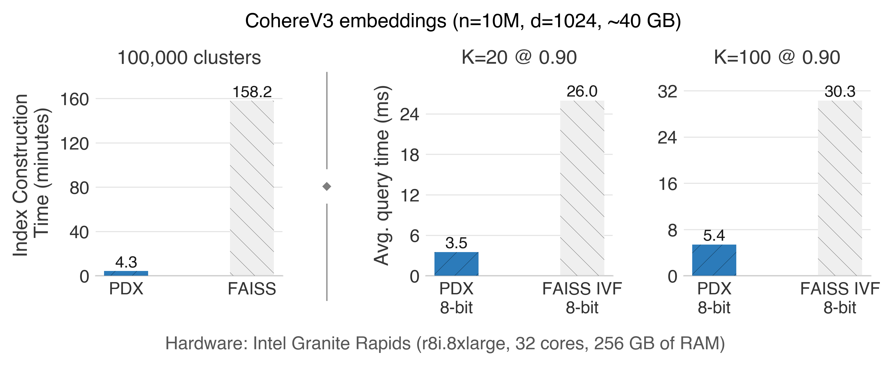
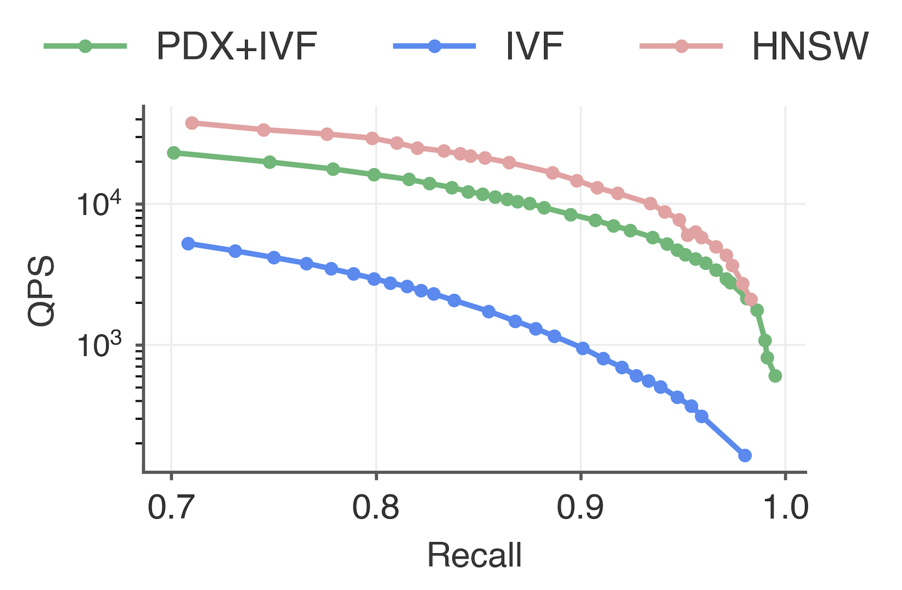
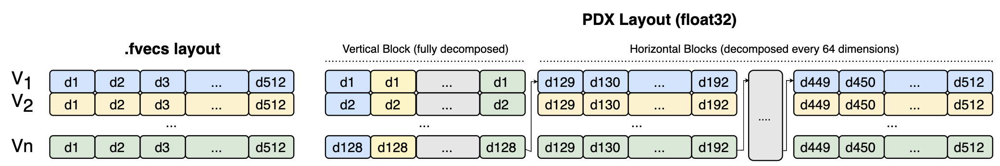
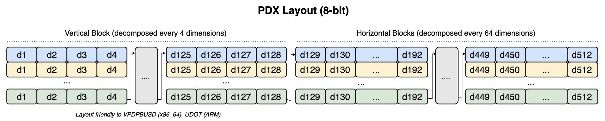

<h1 align="center">
  PDX: A Library for Fast Vector Search and Indexing
<div align="center">
    <a href="https://arxiv.org/pdf/2503.04422"></a>
    
    <a href="https://github.com/cwida/PDX/blob/main/LICENSE"></a>
    <a href="https://github.com/cwida/PDX/stargazers"></a>
</div>
</h1>
<h3 align="center">
  Index millions of vectors in seconds. Search them in milliseconds.
</h3>

<p align="center">
        
</p>

<!-- <h3 align="center">
  Build your vector index 100x faster than HNSW, without being slow:
</h3>
<p align="center">
        
</p> -->

## Why PDX?

- ⚡ [**30x faster index building**](https://www.lkuffo.com/superkmeans/) thanks to [SuperKMeans](https://github.com/lkuffo/SuperKMeans).
- ⚡ [**Sub-millisecond similarity search**](https://www.lkuffo.com/sub-milisecond-similarity-search-with-pdx/), up to [**10x faster**](./BENCHMARKING.md#two-level-ivf-ivf2-) than FAISS IVF.
- ⚡ Up to [**30x faster**](./BENCHMARKING.md#exhaustive-search--ivf) exhaustive search.
- 🔍 Efficient [**filtered search**](https://github.com/cwida/PDX/issues/7).
- Query latency competitive with HNSW, with the ease of use of IVF.

## Our secret sauce

[PDX](https://ir.cwi.nl/pub/35044/35044.pdf) is a data layout that **transposes** vectors in a column-major order. This layout unleashes the true potential of dimension pruning.

Pruning means avoiding checking *all* the dimensions of a vector to determine if it is a neighbour of a query, accelerating index construction and similarity search by factors.

## Use Cases and Benchmarking
Check [./BENCHMARKING.md](./BENCHMARKING.md).

## Usage

```py
from pdxearch import IndexPDXIVFTreeSQ8

data = ... # Numpy 2D matrix
query = ... # Numpy 1D array
d = 1024
knn = 20

index = IndexPDXIVFTreeSQ8(num_dimensions=d)
index.build(data)

ids, dists = index.search(query, knn)

```

`IndexPDXIVFTreeSQ8` is our fastest index that will give you the best performance. It is a two-level IVF index with 8-bit quantization.

Check our [examples](./examples/) for fully working examples in Python and our [benchmarks](./benchmarks) for fully working examples in C++. We support Flat (`float32`) and Quantized (`8-bit`) indexes, as well as the most common distance metrics. 

## Installation
We provide Python bindings for ease of use. Soon, we will be available on PyPI.

### Prerequisites
- Clang 17, CMake 3.26
- OpenMP
- A BLAS implementation
- Python 3 (only for Python bindings)

### Installation Steps
```sh
git clone --recurse-submodules https://github.com/cwida/PDX
cd PDX

pip install .

# Run the examples under `/examples`
# pdx_simple.py creates an IVF index with FAISS on random data
# Then, it compares the search performance of PDX and FAISS
python ./examples/pdx_simple.py
```

For a more comprehensive installation and compilation guide, check [INSTALL.md](./INSTALL.md).

## Getting the Best Performance
Check [INSTALL.md](./INSTALL.md).

## Roadmap
We are actively developing Super K-Means and accepting contributions! Check [CONTRIBUTING.md](./CONTRIBUTING.md)

## The Data Layout
PDX is a transposed layout (a.k.a. columnar, or decomposed layout), meaning that the dimensions of different vectors are stored sequentially. This decomposition occurs within a block (e.g., a cluster in an IVF index). 

We have evolved our layout from the one presented in our publication to reduce random access, and adapted it to work with `8-bit` and (in the future) `1-bit` vectors. 

### `float32`
For `float32`, the first 25% of the dimensions are fully decomposed. We refer to this as the "vertical block." The rest (75%) are decomposed into subvectors of 64 dimensions. We refer to this as the "horizontal block." The vertical block is used for efficient pruning, and the horizontal block is accessed on the candidates that were not pruned. This horizontal block is still decomposed every 64 dimensions. The idea behind this is that we still have a chance to prune the few remaining candidates every 64 dimensions. 

The following image shows this layout. Storage is sequential from left to right, and from top to bottom.
<p align="center">
        
</p>

### `8 bits`
Smaller data types are not friendly to PDX, as we must accumulate distances on wider types, resulting in asymmetry. We can work around this by changing the PDX layout. For `8 bits`, the vertical block is decomposed every 4 dimensions. This allows us to use dot-product instructions (`VPDPBUSD` on [x86](https://www.officedaytime.com/simd512e/simdimg/si.php?f=vpdpbusd) and `UDOT/SDOT` on [NEON](https://developer.arm.com/documentation/102651/a/What-are-dot-product-intructions-)) to calculate L2 or IP kernels while still benefiting from PDX. The horizontal block remains decomposed every 64 dimensions. 
<p align="center">
        
</p>


<!-- ### `binary`
For Hamming/Jaccard kernels, we use a layout decomposed every 8 dimensions (naturally grouped into bytes). The population count accumulation can be done in `bytes`. If d > 256, we flush the popcounts into a wider type every 32 words (corresponding to 256 dimensions). This has not been implemented in this repository yet, but you can find some promising benchmarks [here](https://github.com/lkuffo/binary-index).  -->


## Citation
If you use PDX for your research, consider citing us:

```
@article{kuffo2025pdx,
  title={PDX: A Data Layout for Vector Similarity Search},
  author={Kuffo, Leonardo and Krippner, Elena and Boncz, Peter},
  journal={Proceedings of the ACM on Management of Data},
  volume={3},
  number={3},
  pages={1--26},
  year={2025},
  publisher={ACM New York, NY, USA}
}
```
