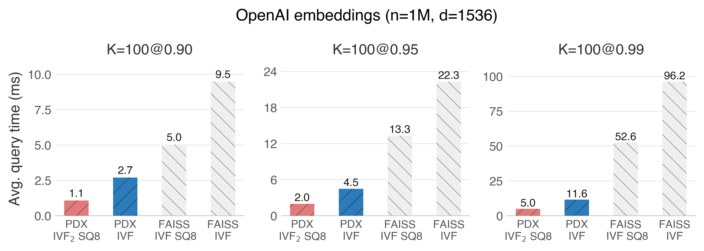
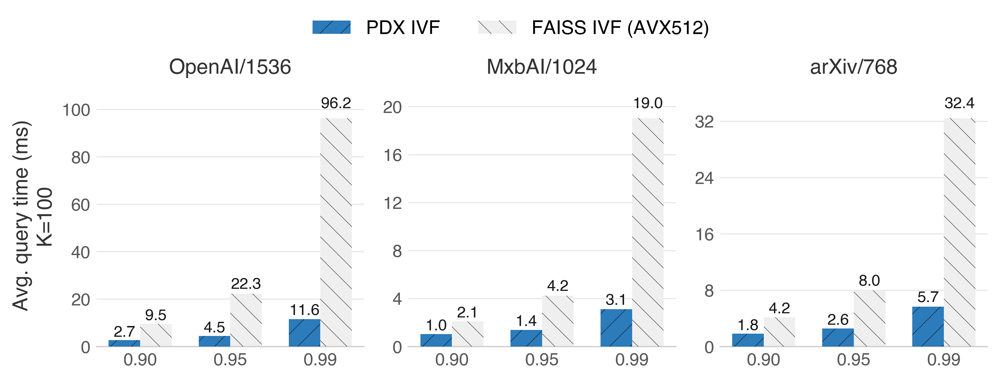

<h1 align="center">
  PDX: A Transposed Data Layout for Similarity Search
<div align="center">
    <a href="https://arxiv.org/pdf/2503.04422"></a>
    <a href="https://github.com/cwida/PDX/blob/main/LICENSE"></a>
    <a href="https://github.com/cwida/PDX/stargazers"></a>
</div>
</h1>

[PDX](https://ir.cwi.nl/pub/35044/35044.pdf) is a data layout that **transposes** vectors in a column-major order. This layout unleashes the true potential of dimension pruning, accelerating vanilla IVF indexes by factors:

<p align="center">
        
</p>

PDX makes an IVF index, competitive with HNSW:
<p align="center">
        
</p>

### PDX benefits:

- ⚡ Up to [**10x faster**](#two-level-ivf-ivf2-) **IVF searches** than FAISS+AVX512.
- ⚡ Up to [**30x faster**](#exhaustive-search--ivf) **exhaustive search**.
- 🔍 Efficient [**filtered search**](https://github.com/cwida/PDX/issues/7).

<hr/>

## Contents
- [Pruning in a nutshell](#pruning-in-a-nutshell)
- [Try PDX](#try-pdx)
- [Use cases (comparison with FAISS)](#use-cases-and-benchmarks)
- [The data layout](#the-data-layout)
- [Roadmap](#roadmap)

## Pruning in a nutshell

Pruning means avoiding checking *all* the dimensions of a vector to determine if it is a neighbour of a query. The PDX layout unleashes the true potential of these algorithms (e.g., [ADSampling](https://github.com/gaoj0017/ADSampling/)), accelerating vanilla IVF indexes by factors.

Pruning is especially effective for large embeddings (`d > 512`) and when targeting high recalls (`> 0.90`) or nearly exact results.

[Down below](#use-cases-and-benchmarks), you will find **benchmarks** against FAISS. 


## Try PDX
Try PDX with your data using our Python bindings and [examples](/examples). We have implemented PDX on Flat (`float32`) and Quantized (`8-bit`) **IVF indexes** and **exhaustive search** settings.
### Prerequisites
- PDX is available for x86_64 (with AVX512), ARM, and Apple silicon
- Python 3.11 or higher
- [FAISS](https://github.com/facebookresearch/faiss/blob/main/INSTALL.md) with Python Bindings
- Clang++17 or higher
- CMake 3.26 or higher

### Installation Steps
1. Clone and init submodules
```sh
git clone https://github.com/cwida/PDX
git submodule init
git submodule update
```

2. *[Optional]* Install [FFTW](https://www.fftw.org/fftw3_doc/Installation-on-Unix.html) (for higher throughput)
```sh
wget https://www.fftw.org/fftw-3.3.10.tar.gz
tar -xvzf fftw-3.3.10.tar.gz
cd fftw-3.3.10
./configure --enable-float --enable-shared  
sudo make
sudo make install
ldconfig
```

3. Install Python dependencies and the bindings. 
```sh
export CXX="/usr/bin/clang++-18"  # Set proper CXX first
pip install -r requirements.txt
python setup.py clean --all
python -m pip install .
```
4. Run the examples under `/examples`
```sh
# Creates an IVF index with FAISS on random data
# Then, it compares the search performance of PDXearch and FAISS
python ./examples/pdx_simple.py
```
For more details on the available examples and how to use your own data, refer to [/examples/README.md](./examples/README.md). 

> [!NOTE]
> We heavily rely on [FAISS](https://github.com/facebookresearch/faiss/blob/main/INSTALL.md) to create the underlying IVF indexes. To quickly install it you can do: `pip install faiss-cpu`

## Use Cases and Benchmarks
We present single-threaded **benchmarks** against FAISS+AVX512 on an `r7iz.xlarge` (Intel Sapphire Rapids) instance. 

### Two-Level IVF (IVF<sub>2</sub>) 
IVF<sub>2</sub> tackles a bottleneck of IVF indexes: finding the nearest centroids. By clustering the original IVF centroids, we can use PDX to quickly scan them (thanks to pruning) without sacrificing recall. This achieves significant throughput improvements when paired with `8-bit` quantization.

<p align="center">
        
</p>

### Vanilla IVF
Here, PDX, paired with the pruning algorithm ADSampling on `float32`, achieves significant speedups.

<p align="center">
        
</p>


### Exhaustive search + IVF
An exhaustive search scans all the vectors in the collection. Having an IVF index with PDX can **EXTREMELY** accelerate this without sacrificing recall, thanks to the reliable pruning of ADSampling.

<p align="center">
        
</p>

The key observation here is that thanks to the underlying IVF index, the exhaustive search starts with the most promising clusters. A tight threshold is found early on, which enables the quick pruning of most candidates.

### Exhaustive search without an index
By creating random clusters with the PDX layout, you can still accelerate exhaustive search without an index. Unlike ADSampling, with BOND (our pruning algorithm), you can use the raw vectors. Gains vary depending on the distribution of the data. 

<p align="center">
        
</p>

### No pruning and no index
Even without pruning, PDX distance kernels can be faster than SIMD ones in most CPU microarchitectures. For detailed information, check Figure 3 of [our publication](https://ir.cwi.nl/pub/35044/35044.pdf). You can also try it yourself in our playground [here](./benchmarks/bench_kernels).

## The Data Layout
PDX is a transposed layout (a.k.a. columnar, or decomposed layout), which means that the same dimensions of different vectors are stored sequentially. This decomposition occurs within a block (e.g., a cluster in an IVF index). 

We have evolved our layout from the one presented in our publication to reduce random access, and adapted it to work with `8-bit` and (in the future) `1-bit` vectors. 

### `float32`
For `float32`, the first 25% of the dimensions are fully decomposed. We refer to this as the "vertical block." The rest (75%) are decomposed into subvectors of 64 dimensions. We refer to this as the "horizontal block." The vertical block is used for efficient pruning, and the horizontal block is accessed on the candidates that were not pruned. This horizontal block is still decomposed every 64 dimensions. The idea behind this is that we still have a chance to prune the few remaining candidates every 64 dimensions. 

The following image shows this layout. Storage is sequential from left to right, and from top to bottom.
<p align="center">
        
</p>

### `8 bits`
Smaller data types are not friendly to PDX, as we must accumulate distances on wider types, resulting in asymmetry. We can work around this by changing the PDX layout. For `8 bits`, the vertical block is decomposed every 4 dimensions. This allows us to use dot product instructions (`VPDPBUSD` in [x86](https://www.officedaytime.com/simd512e/simdimg/si.php?f=vpdpbusd) and `UDOT/SDOT` in [NEON](https://developer.arm.com/documentation/102651/a/What-are-dot-product-intructions-)) to calculate L2 or IP kernels while still benefiting from PDX. The horizontal block remains decomposed every 64 dimensions. 
<p align="center">
        
</p>

### `binary`
For Hamming/Jaccard kernels, we use a layout decomposed every 8 dimensions (naturally grouped into bytes). The population count accumulation can be done in `bytes`. If d > 256, we flush the popcounts into a wider type every 32 words (corresponding to 256 dimensions). This has not been implemented in this repository yet, but you can find some promising benchmarks [here](https://github.com/lkuffo/binary-index). 

## Roadmap
- Out-of-core execution (disk-based setting).
- Add unit tests.
- Implement multi-threading capabilities.
- Add PDX to the [VIBE benchmark](https://vector-index-bench.github.io/).
- Adaptive quantization on 8-bit and 4-bit.
- Create a documentation.

> [!IMPORTANT]   
> PDX is an ongoing research project. In its current state, it is not production-ready code.

## Benchmarking
To run our benchmark suite in C++, refer to [BENCHMARKING.md](./BENCHMARKING.md).

## Citation
If you use PDX for your research, consider citing us:

```
@article{kuffo2025pdx,
  title={PDX: A Data Layout for Vector Similarity Search},
  author={Kuffo, Leonardo and Krippner, Elena and Boncz, Peter},
  journal={Proceedings of the ACM on Management of Data},
  volume={3},
  number={3},
  pages={1--26},
  year={2025},
  publisher={ACM New York, NY, USA}
}
```

## SIGMOD
The code used for the experiments presented at SIGMOD'25 can be found in the `sigmod` branch.
